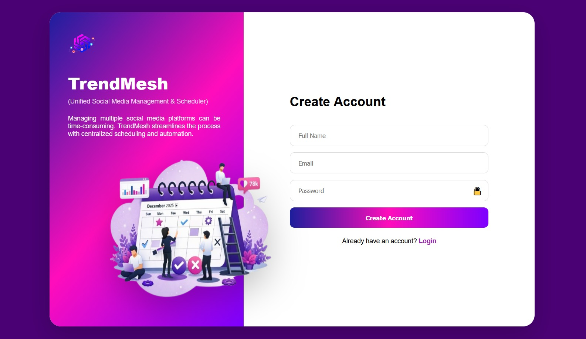
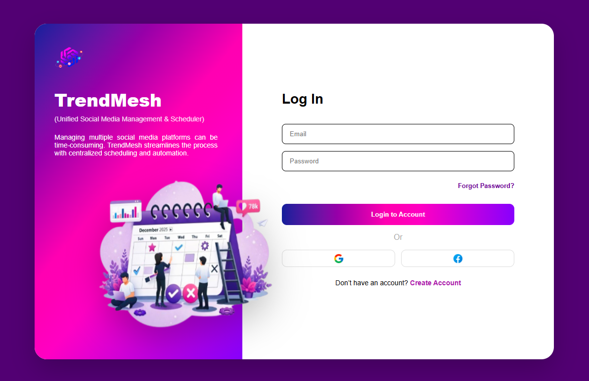
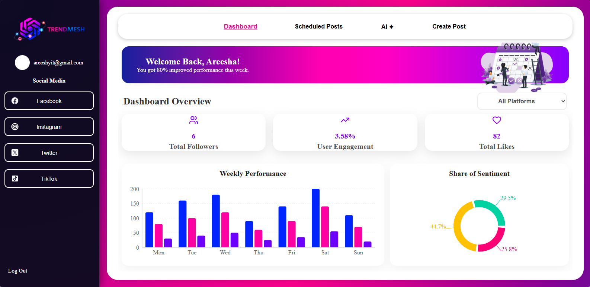
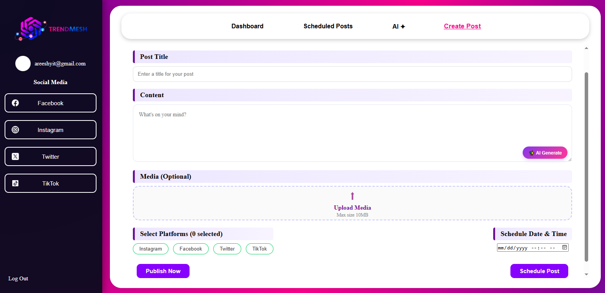
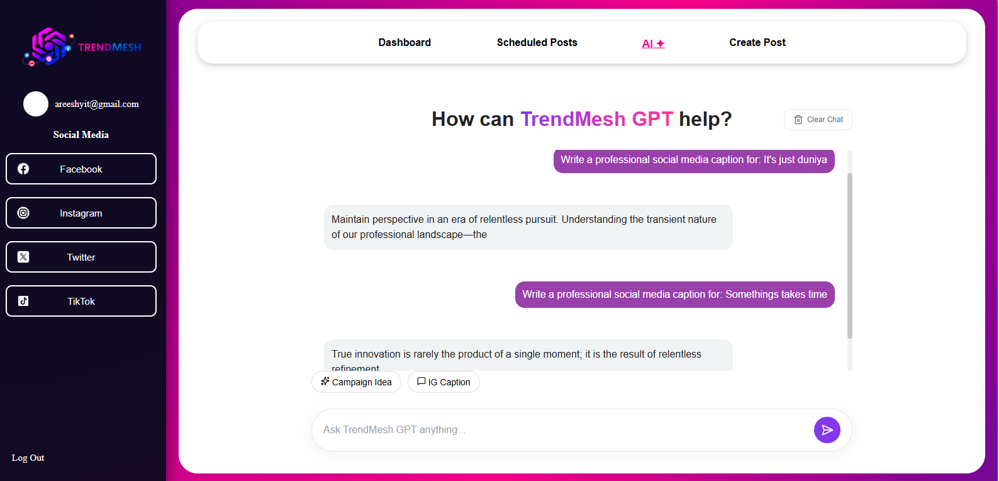
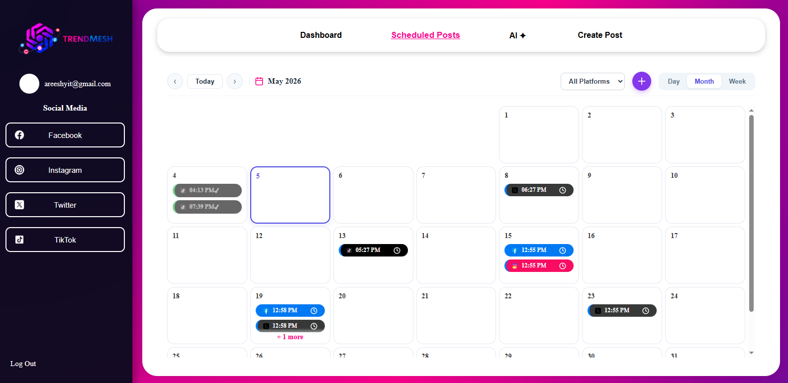
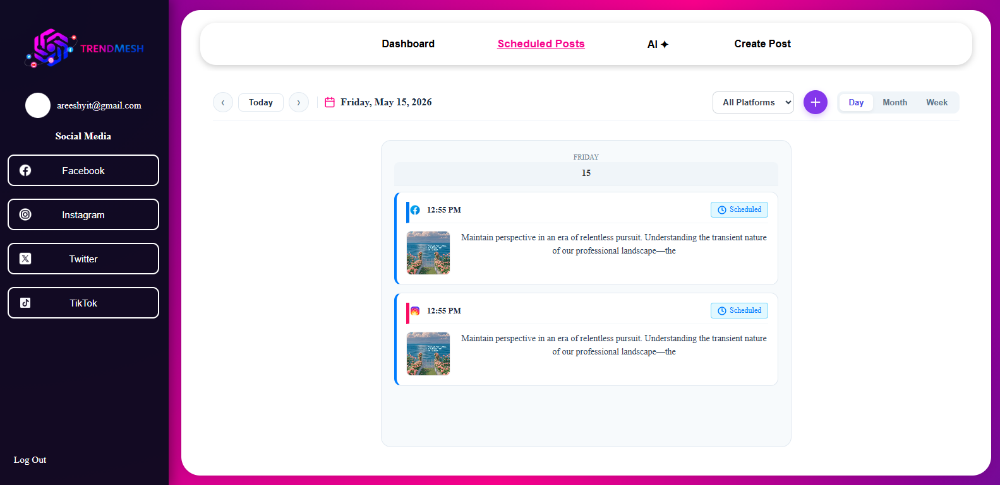
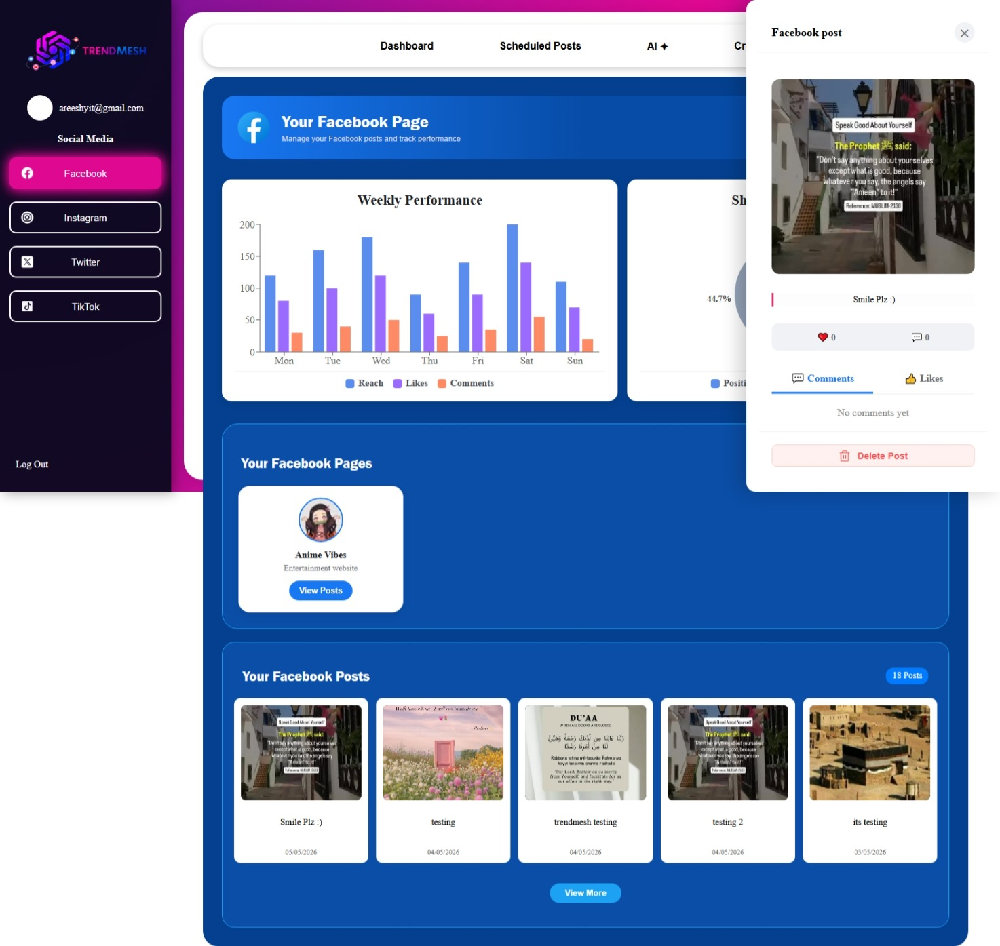
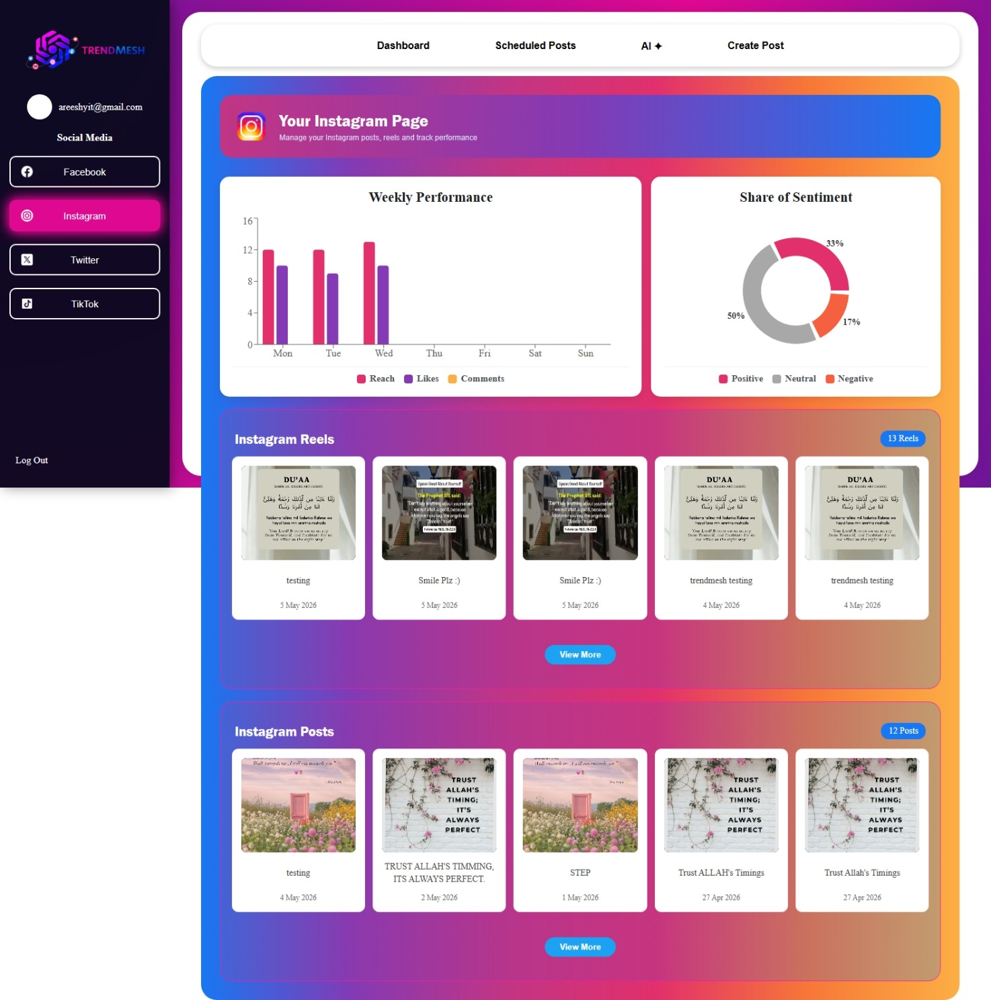
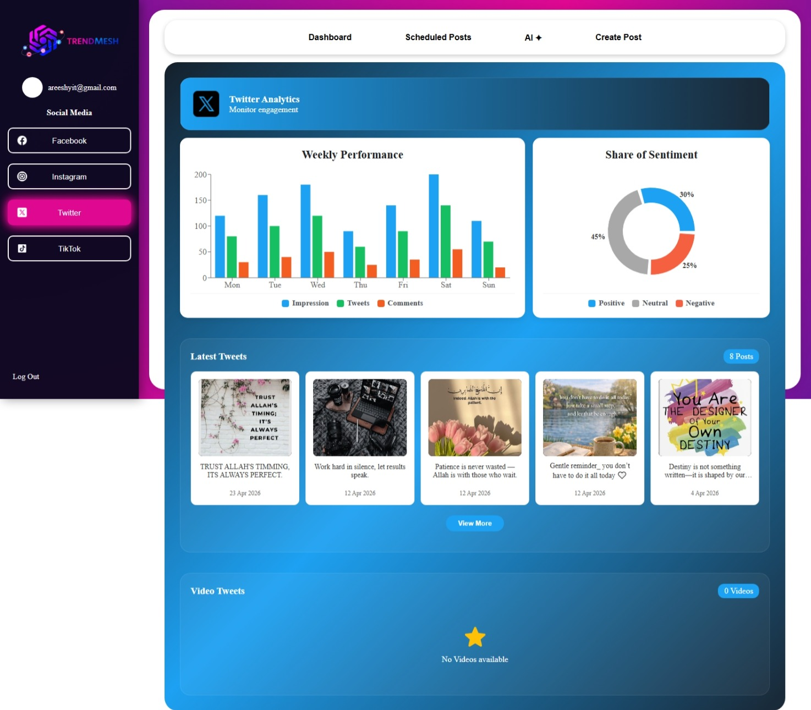

# 📊 TrendMesh — Multi-Platform Analytics & Social Media Dashboard

TrendMesh is an advanced analytics dashboard that consolidates key metrics, post creation, and scheduling for major social media platforms—including TikTok, Instagram, Facebook, and Twitter—into a single, unified interface. It empowers content creators and brands to track their growth and manage content seamlessly.

---

## 🚀 Key Features

- **Multi-Platform Integration:** Sync and view metrics for Facebook, Instagram, Twitter, and TikTok side-by-side.
- **Smart Analytics Dashboard:** Clean, data-driven visualization of user engagement, reach, and follower growth.
- **AI-Powered Content Assistance:** Built-in AI tools to assist in content brainstorming and post optimization.
- **Dynamic Content Planner:** Interactive scheduling tools featuring Day, Week, and Month views for structured planning.

---

## 📸 Screenshots & Demo

### 🎥 Project Demo Video

  <video src="https://github.com/user-attachments/assets/69a6592a-3dd4-4806-bbe9-9355c17b063c" width="85%" controls muted autoplay loop></video>

### 🖼️ Application Interface

#### 🔐 Authentication & Onboarding

  
  

#### 🖥️ Main Analytics Dashboard

  

#### 🧠 Content Creation & AI Assistance

  
  

#### 📅 Content Calendar Planner

  

  
  

#### 📱 Connected Social Networks

  
  
  
  

---

## 🛠️ Tech Stack

- **Frontend:** React.js, Vite
- **Styling:** Standard CSS (No UI utility frameworks, fully customized design)
- **State Management:** React Context API / Custom Hooks
- **Icons:** React Icons

---
